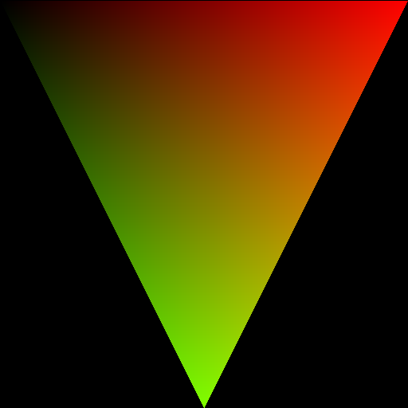

# [01_geom_intersection](../tutorials/01_geom_intersection)

<div align="center">
    
</div>

<br />
First, we create hiprt context.

```cpp
  hiprtContext ctxt;
  hiprtCreateContext( HIPRT_API_VERSION, m_ctxtInput, ctxt );
```
 
<br />
<br />
Then we create vertex and index buffers.

```cpp
  hiprtTriangleMeshPrimitive mesh;
  mesh.triangleCount		   = 1;
  mesh.triangleStride		   = sizeof( hiprtInt3 );
  uint32_t triangleIndices[] = { 0, 1, 2 };
  oroMalloc( reinterpret_cast<oroDeviceptr*>( &mesh.triangleIndices ), mesh.triangleCount * sizeof( hiprtInt3 ) );
  oroMemcpyHtoD( reinterpret_cast<oroDeviceptr>( mesh.triangleIndices ),
    triangleIndices,
    mesh.triangleCount * sizeof( hiprtInt3 ) );

  mesh.vertexCount	   = 3;
  mesh.vertexStride	   = sizeof( hiprtFloat3 );
  hiprtFloat3 vertices[] = { { 0.0f, 0.0f, 0.0f }, { 1.0f, 0.0f, 0.0f }, { 0.5f, 1.0f, 0.0f } };
  oroMalloc( reinterpret_cast<oroDeviceptr*>( &mesh.vertices ), mesh.vertexCount * sizeof( hiprtFloat3 ) );
  oroMemcpyHtoD( reinterpret_cast<oroDeviceptr>( mesh.vertices ), vertices, mesh.vertexCount * sizeof( hiprtFloat3 ) );
```

<br />
<br />
The next is preparation of spatial acceleration structure from the vertex, index buffers. A spatial acceleration structure is called `hiprtGeometry`. In the code below, we create a temporary buffer used for the build, create `hiprtGeometry`, then build the geometry with the inputs we provide.

```cpp
  hiprtGeometryBuildInput geomInput;
  geomInput.type					 = hiprtPrimitiveTypeTriangleMesh;
  geomInput.primitive.triangleMesh = mesh;

  size_t			  geomTempSize;
  hiprtDevicePtr	  geomTemp;
  hiprtBuildOptions options;
  options.buildFlags = hiprtBuildFlagBitPreferFastBuild;
  hiprtGetGeometryBuildTemporaryBufferSize( ctxt, geomInput, options, geomTempSize );
  oroMalloc( reinterpret_cast<oroDeviceptr*>( &geomTemp ), geomTempSize );

  hiprtGeometry geom;
  hiprtCreateGeometry( ctxt, geomInput, options, geom );
  hiprtBuildGeometry( ctxt, hiprtBuildOperationBuild, geomInput, options, geomTemp, 0, geom );
```

<br />
<br />
Once it is done, we are ready to trace rays on the GPU in a kernel you write. Here is a kernel used in this tutorial.

```cpp
  #include <hiprt/hiprt_device.h>
  #include <hiprt/hiprt_vec.h>

  extern "C" __global__ void GeomIntersectionKernel( hiprtGeometry geom, uint8_t* pixels, int2 res )
  {
    const uint32_t x	 = blockIdx.x * blockDim.x + threadIdx.x;
    const uint32_t y	 = blockIdx.y * blockDim.y + threadIdx.y;
    const uint32_t index = x + y * res.x;

    float3 o = { x / static_cast<float>( res.x ), y / static_cast<float>( res.y ), -1.0f };
    float3 d = { 0.0f, 0.0f, 1.0f };

    hiprtRay ray;
    ray.origin	  = o;
    ray.direction = d;

    hiprtGeomTraversalClosest tr( geom, ray );
    hiprtHit				  hit = tr.getNextHit();

    pixels[index * 4 + 0] = hit.hasHit() ? ( static_cast<float>( x ) / res.x ) * 255 : 0;
    pixels[index * 4 + 1] = hit.hasHit() ? ( static_cast<float>( y ) / res.y ) * 255 : 0;
    pixels[index * 4 + 2] = 0;
    pixels[index * 4 + 3] = 255;
}
```

<br />
<br />
This is nothing but just a regular HIP kernel other than passing `hiprtGeometry`. What you find new in the kernel is the 2 lines. We create traversal object which keeps the state of the ray and execute the traversal. `tr.getNextHit()` does the ray tracing and find the hit we need.

```cpp
  hiprtGeomTraversalClosest tr( geom, ray );
  hiprtHit hit = tr.getNextHit();
```

<br />
<br />
The kernel above has hiprt functions in it. Thus, it needs to be compiled with the hiprt headers (and bitcodes) which is done in this line.

```cpp
  oroFunction func;
  buildTraceKernelFromBitcode( ctxt, "../common/TutorialKernels.h", "GeomIntersectionKernel", func );
```

<br />
<br />
That’s all we need to do for preparation. Now we can launch the kernel and see the first triangle.

```cpp
  uint8_t* pixels;
  oroMalloc( reinterpret_cast<oroDeviceptr*>( &pixels ), m_res.x * m_res.y * 4 );

  void* args[] = { &geom, &pixels, &m_res };
  launchKernel( func, m_res.x, m_res.y, args );
  writeImage( "01_geom_intersection.png", m_res.x, m_res.y, pixels );
```
