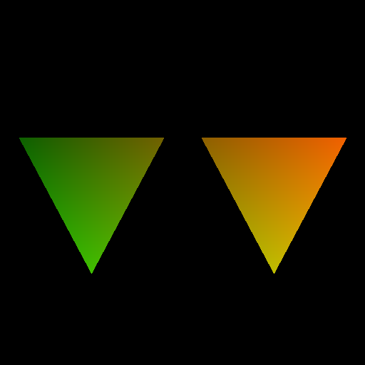

# [02_scene_intersection](../tutorials/02_scene_intersection)

<br />

This demo illustrates the usage of the `hiprtScene` object in the HIPRT API, focusing on creating, building, and using a scene for ray tracing. <br />
The triangle mesh is the basic primitive of HIPRT from which we build `hiprtGeometry`. 
In general, scenes are comprised of many meshes. Developers can utilize `hiprtScene` support on top of these meshes to create an acceleration structure which can be used to search for a mesh efficiently when there are many meshes.

<div align="center">
    
</div>


The geometry setup of this demo is close to the [previous demo](01_geom_intersection.md). We are just creating 2 triangles instead of 1.

<br />
<br />

The difference compared to the previous demo is that we use `hiprtScene`. First, we need to set the `sceneInput` that will be used to create and build the `hiprtScene`.
An instance of the geometry is created and added to the scene. The `sceneInput` is configured with this instance, and transformation parameters are set:

```cpp
  hiprtInstance instance;
  instance.type    = hiprtInstanceTypeGeometry;
  instance.geometry = geom;

  hiprtSceneBuildInput sceneInput;
  sceneInput.instanceCount      = 1;
  sceneInput.instanceMasks      = nullptr;
  sceneInput.instanceTransformHeaders = nullptr;
  oroMalloc( reinterpret_cast<oroDeviceptr*>( &sceneInput.instances ), sizeof( hiprtInstance ) );
  oroMemcpyHtoD( reinterpret_cast<oroDeviceptr>( sceneInput.instances ), &instance, sizeof( hiprtInstance ) );

  hiprtFrameSRT frame;
  frame.translation    = make_hiprtFloat3( 0.0f, 0.0f, 0.0f );
  frame.scale        = make_hiprtFloat3( 0.5f, 0.5f, 0.5f );
  frame.rotation      = make_hiprtFloat4( 0.0f, 0.0f, 1.0f, 0.0f );
  sceneInput.frameCount = 1;
  oroMalloc( reinterpret_cast<oroDeviceptr*>( &sceneInput.instanceFrames ), sizeof( hiprtFrameSRT ) );
  oroMemcpyHtoD( reinterpret_cast<oroDeviceptr>( sceneInput.instanceFrames ), &frame, sizeof( hiprtFrameSRT ) );
```

If there are more meshes in a scene, we need to create many geometries. 

<br />
<br />

The scene is built using HIPRT functions. Note that we need to create a temporary buffer. Temporary buffers are intermediate memory allocations used during the construction of the geometry and scene in HIPRT. 
These buffers are necessary for storing intermediate data required by the HIPRT API to build complex structures, such as BVHs or other acceleration structures, but are not needed once the build process is complete. Therefore, we can release it after the build. 

```cpp
  size_t       sceneTempSize;
  hiprtDevicePtr sceneTemp = nullptr;
  hiprtGetSceneBuildTemporaryBufferSize( ctxt, sceneInput, options, sceneTempSize );
  oroMalloc( reinterpret_cast<oroDeviceptr*>( &sceneTemp ), sceneTempSize );

  hiprtScene scene = nullptr;
  hiprtCreateScene( ctxt, sceneInput, options, scene );
  hiprtBuildScene( ctxt, hiprtBuildOperationBuild, sceneInput, options, sceneTemp, 0, scene );

  // we can free the Temporary Buffer just after hiprtBuildScene, as this buffer is only used during the build.
  oroFree( reinterpret_cast<oroDeviceptr>( sceneTemp ) );
  sceneTemp = nullptr;
```
<br />
<br />

Concerning the kernel it is also close to the previous demo, but instead of manipulating `hiprtGeometry`, it uses `hiprtScene`. <br />
so, `hiprtGeometry` is replaced by `hiprtScene`, and `hiprtGeomTraversalClosest` is replaced by `hiprtSceneTraversalClosest`.


  
