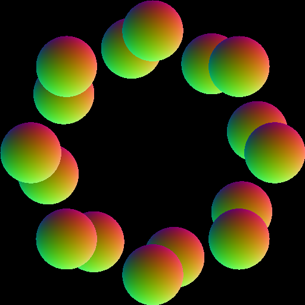

# [03_custom_intersection](../tutorials/03_custom_intersection)

<br />

If your scene contains primitives other than triangles, HIPRT can handle them too. All you need to do is provide a custom intersection function for the geometry, register the function in HIPRT, then this function will be called when a ray intersects with the primitive.

<div align="center">
    
</div>

<br />

Here `intersectSphere` is the custom intersection kernel we want to execute on our geometry.

```cpp
  // check if there is a hit before ray.maxT. if there is, set it to tOut. hiprt will overwrite ray.maxT after this function
  __device__ bool intersectSphere( const hiprtRay& ray, const void* data, void* payload, hiprtHit& hit )
  {
    float3 from    = ray.origin;
    float3 to    = from + ray.direction * ray.maxT;
    float4 sphere = reinterpret_cast<const float4*>( data )[hit.primID];
    float3 center = make_float3( sphere );
    float  r    = sphere.w;

    float3 m  = from - center;
    float3 d  = to - from;
    float  a  = dot( d, d );
    float  b  = 2.0f * dot( m, d );
    float  c  = dot( m, m ) - r * r;
    float  dd = b * b - 4.0f * a * c;
    if ( dd < 0.0f ) return false;

    float t = ( -b - sqrtf( dd ) ) / ( 2.0f * a );
    if ( t > 1.0f ) return false;

    hit.t     = t * ray.maxT;
    hit.normal = normalize( from + ray.direction * hit.t - center );

    return true;
  }
```

<br />
<br />


To execute this kernel on our geometry, first we need to set the `geomType` on it. here we use 1 custom types, so `0` is the first index in our function table
```cpp
  hiprtGeometryBuildInput geomInput;
  geomInput.type               = hiprtPrimitiveTypeAABBList;
  geomInput.primitive.aabbList = list;
  geomInput.geomType           = 0;
```

<br />
<br />

We also need to define our function table, containing the list of all the custom functions. In our demo, we have only 1 custom function.
```cpp
  hiprtFuncNameSet funcNameSet;
  funcNameSet.intersectFuncName              = "intersectSphere";
  std::vector<hiprtFuncNameSet> funcNameSets = { funcNameSet };
```

<br />
<br />

When we build the kernel, we need to use the arguments: `funcNameSets`, `numGeomTypes`, `numRayTypes`.<br />
- `funcNameSets`, the `std::vector` we created previously.
- `numGeomTypes`, the number of geometry types we use. In our sample we use 1.
- `numRayTypes`, the number of ray types we use. Keep it to 1 ( which is the default value ) as we do not want different ray types in this demo.
```cpp
  oroFunction func;
  buildTraceKernelFromBitcode(ctxt, "../common/TutorialKernels.h", "CustomIntersectionKernel", func, nullptr, &funcNameSets, 1, 1 );
```

<br />
<br />

We also need to build a `hiprtFuncTable`,

```cpp
  hiprtFuncTable funcTable;
  hiprtCreateFuncTable( ctxt, 1, 1, funcTable );
  hiprtSetFuncTable( ctxt, funcTable, 0, 0, funcDataSet );
```

<br />

and give it as an argument to the main kernel execution...
```cpp
void* args[] = { &geom, &pixels, &funcTable, &m_res };
```
<br />

... as the kernel needs it.<br />
Here is how `hiprtFuncTable table` is used on the kernel side :

```cpp
  extern "C" __global__ void CustomIntersectionKernel( hiprtGeometry geom, uint8_t* pixels, hiprtFuncTable table, int2 res )
  {
    const uint32_t x   = blockIdx.x * blockDim.x + threadIdx.x;
    const uint32_t y   = blockIdx.y * blockDim.y + threadIdx.y;
    const uint32_t index = x + y * res.x;

    hiprtRay ray;
    ray.origin    = { x / static_cast<float>( res.x ) - 0.5f, y / static_cast<float>( res.y ) - 0.5f, -1.0f };
    ray.direction = { 0.0f, 0.0f, 1.0f };
    ray.maxT    = 100000.0f;

    hiprtGeomCustomTraversalClosest tr( geom, ray, hiprtTraversalHintDefault, nullptr, table );
    hiprtHit            hit = tr.getNextHit();

    pixels[index * 4 + 0] = hit.hasHit() ? ( hit.normal.x + 1.0f ) / 2.0f * 255 : 0;
    pixels[index * 4 + 1] = hit.hasHit() ? ( hit.normal.y + 1.0f ) / 2.0f * 255 : 0;
    pixels[index * 4 + 2] = hit.hasHit() ? ( hit.normal.z + 1.0f ) / 2.0f * 255 : 0;
    pixels[index * 4 + 3] = 255;
  }
```
  
<br />

In this tutorial, we explained simple usage of custom intersection where there is only single custom geometry type. More complex example can be found at the demo [11_multi_custom_intersection](../tutorials/11_multi_custom_intersection) which is similar but uses several custom types.


