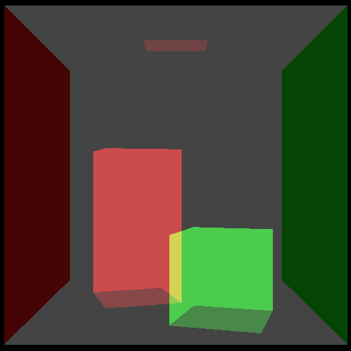

# [07_custom_bvh_import](../tutorials/07_custom_bvh_import)

<br />

<div align="center">
    
</div>


One interesting feature that HIPRT supports is importing a custom BVH. The
build input structure has an optional list of nodes defining a topology and bounding boxes of the
custom BVH. If the list is specified, then HIPRT skips the build and just converts the nodes from
the API format to the internal format. This feature might be useful for research, allowing users to
benchmark their BVH builders with HIPRT hardware-accelerated kernels. This demo illustrates the process.

<br />

Steps to Import a custom BVH:

- Skip the geometry temporary buffer: You do not need to use the usual `geomTemp` buffer, which is typically built with `hiprtGetGeometryBuildTemporaryBufferSize`.
- Set the build flags: In the `buildFlags` of `hiprtBuildOptions`, specify the `hiprtBuildFlagBitCustomBvhImport` flag.
- Build your custom BVH.

<br />
<br />

The BVH building is done inside `buildBvh` in the demo.
The main task of `buildBvh` is to build the `nodeList` of `hiprtGeometryBuildInput`. This node list is optional and only used for custom BVH.<br />
<br />
First, `buildBvh` builds of list of AABB boxes, from the Device's data.

```cpp
  std::vector<Aabb>   primBoxes( buildInput.primitive.triangleMesh.triangleCount );
  std::vector<uint8_t> verticesRaw(buildInput.primitive.triangleMesh.vertexCount *
                       buildInput.primitive.triangleMesh.vertexStride );
  std::vector<uint8_t> trianglesRaw(buildInput.primitive.triangleMesh.triangleCount *
                       buildInput.primitive.triangleMesh.triangleStride );
  oroMemcpyDtoH(
    verticesRaw.data(),
    reinterpret_cast<oroDeviceptr>( buildInput.primitive.triangleMesh.vertices ),
    buildInput.primitive.triangleMesh.vertexCount * buildInput.primitive.triangleMesh.vertexStride );
  oroMemcpyDtoH(
    trianglesRaw.data(),
    reinterpret_cast<oroDeviceptr>( buildInput.primitive.triangleMesh.triangleIndices ),
    buildInput.primitive.triangleMesh.triangleCount * buildInput.primitive.triangleMesh.triangleStride );
  for ( uint32_t i = 0; i < buildInput.primitive.triangleMesh.triangleCount; ++i )
  {
    hiprtInt3 triangle = *reinterpret_cast<hiprtInt3*>( trianglesRaw.data() +
                            i * buildInput.primitive.triangleMesh.triangleStride );
    hiprtFloat3 v0 = *reinterpret_cast<const hiprtFloat3*>( verticesRaw.data() +
                           triangle.x * buildInput.primitive.triangleMesh.vertexStride );
    hiprtFloat3 v1 = *reinterpret_cast<const hiprtFloat3*>( verticesRaw.data() +
                           triangle.y * buildInput.primitive.triangleMesh.vertexStride );
    hiprtFloat3 v2 = *reinterpret_cast<const hiprtFloat3*>( verticesRaw.data() +
                           triangle.z * buildInput.primitive.triangleMesh.vertexStride );
    primBoxes[i].reset();
    primBoxes[i].grow( v0 );
    primBoxes[i].grow( v1 );
    primBoxes[i].grow( v2 );
  }
```

<br />
<br />

Then, it's calling `BvhBuilder::build`. This function builds a BVH from a list of bounding boxes. 
It sorts and splits these boxes along different axes to create a tree structure. Each node in the tree represents a bounding box, helping to quickly find intersections in ray tracing.

```cpp
  static void build( uint32_t nPrims, const std::vector<Aabb>& primBoxes, std::vector<hiprtBvhNode>& nodes )
  {
    assert( nPrims >= 2 );
    std::vector<Aabb> rightBoxes( nPrims );
    std::vector<int>  tmpIndices( nPrims );
    std::vector<int>  leftIndices( nPrims );

    std::vector<int> indices[3];
    for ( int k = 0; k < 3; ++k )
    {
      indices[k].resize( nPrims );
      for ( int i = 0; i < nPrims; ++i )
        indices[k][i] = i;
      std::sort( indices[k].begin(), indices[k].end(), [&]( int a, int b ) {
        hiprtFloat3 ca = primBoxes[a].center();
        hiprtFloat3 cb = primBoxes[b].center();
        return reinterpret_cast<float*>( &ca )[k] > reinterpret_cast<float*>( &cb )[k];
      } );
    }

    Aabb box;
    for ( int i = 0; i < nPrims; ++i )
      box.grow( primBoxes[i] );

    std::queue<QueueEntry> queue;
    queue.push( QueueEntry( 0, 0, nPrims, box ) );
    nodes.push_back( hiprtBvhNode() );
    while ( !queue.empty() )
    {
      int   nodeIndex = queue.front().m_nodeIndex;
      int   begin     = queue.front().m_begin;
      int   end     = queue.front().m_end;
      Aabb box     = queue.front().m_box;
      queue.pop();

      float minCost  = FLT_MAX;
      int    minAxis  = 0;
      int    minIndex = 0;
      Aabb  minLeftBox, minRightBox;
      for ( int k = 0; k < 3; ++k )
      {

        rightBoxes[end - 1] = primBoxes[indices[k][end - 1]];
        for ( int i = end - 2; i >= begin; --i )
          rightBoxes[i] = Aabb( primBoxes[indices[k][i]], rightBoxes[i + 1] );

        Aabb leftBox, rightBox;
        for ( int i = begin; i < end - 1; ++i )
        {
          int leftCount  = ( i + 1 ) - begin;
          int rightCount = end - ( i + 1 );
          leftBox.grow( primBoxes[indices[k][i]] );
          rightBox   = rightBoxes[i + 1];
          float cost = leftBox.area() * leftCount + rightBox.area() * rightCount;
          if ( cost < minCost )
          {
            minCost    = cost;
            minIndex  = i + 1;
            minAxis    = k;
            minLeftBox  = leftBox;
            minRightBox = rightBox;
          }
          assert( leftBox.area() <= box.area() );
          assert( rightBox.area() <= box.area() );
        }
      }

      assert( minIndex > begin );
      assert( end > minIndex );

      memset( leftIndices.data(), 0, nPrims * sizeof( int ) );
      for ( int i = begin; i < minIndex; ++i )
      {
        int index       = indices[minAxis][i];
        leftIndices[index] = 1;
      }

      for ( int j = 0; j < 3; ++j )
      {
        if ( j != minAxis )
        {
          int k = begin;
          int l = minIndex;
          for ( int i = begin; i < end; ++i )
          {
            int index = indices[j][i];
            if ( leftIndices[indices[j][i]] )
              tmpIndices[k++] = index;
            else
              tmpIndices[l++] = index;
          }
          assert( k == minIndex );
          assert( l == end );
          memcpy( &indices[j][begin], &tmpIndices[begin], ( end - begin ) * sizeof( int ) );
        }
      }

      nodes[nodeIndex].childAabbsMin[0] = minLeftBox.m_min;
      nodes[nodeIndex].childAabbsMax[0] = minLeftBox.m_max;
      nodes[nodeIndex].childAabbsMin[1] = minRightBox.m_min;
      nodes[nodeIndex].childAabbsMax[1] = minRightBox.m_max;
      nodes[nodeIndex].childIndices[2]  = hiprtInvalidValue;
      nodes[nodeIndex].childIndices[3]  = hiprtInvalidValue;

      if ( minIndex - begin == 1 )
      {
        nodes[nodeIndex].childIndices[0]   = indices[minAxis][begin];
        nodes[nodeIndex].childNodeTypes[0] = hiprtBvhNodeTypeLeaf;
      }
      else
      {
        nodes[nodeIndex].childIndices[0]   = static_cast<int>( nodes.size() );
        nodes[nodeIndex].childNodeTypes[0] = hiprtBvhNodeTypeInternal;
        queue.push( QueueEntry( nodes[nodeIndex].childIndices[0], begin, minIndex, minLeftBox ) );
        nodes.push_back( hiprtBvhNode() );
      }

      if ( end - minIndex == 1 )
      {
        nodes[nodeIndex].childIndices[1]   = indices[minAxis][minIndex];
        nodes[nodeIndex].childNodeTypes[1] = hiprtBvhNodeTypeLeaf;
      }
      else
      {
        nodes[nodeIndex].childIndices[1]   = static_cast<int>( nodes.size() );
        nodes[nodeIndex].childNodeTypes[1] = hiprtBvhNodeTypeInternal;
        queue.push( QueueEntry( nodes[nodeIndex].childIndices[1], minIndex, end, minRightBox ) );
        nodes.push_back( hiprtBvhNode() );
      }
    }
  }
```

  

