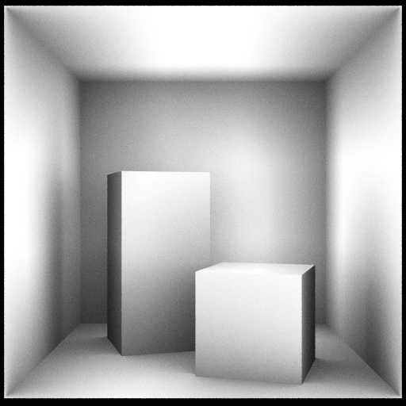

# [08_ambient_occlusion](../tutorials/08_ambient_occlusion)


This demos shows how to compute Ambient Occlusion with HIPRT in the Cornell box scene.

<div align="center">
    
</div>

<br />

The source code on The C++ side ( [main.cpp](../tutorials/08_ambient_occlusion/main.cpp) ) is very close to the one from the first demo: [main.cpp from 01_geom_intersection](../tutorials/01_geom_intersection/main.cpp) presented [here](01_geom_intersection.md). So we won't give much details.
The first difference is that instead of creating one triangle, we create the list of triangles to render the Cornell box scene:

```cpp
  hiprtTriangleMeshPrimitive mesh;
  mesh.triangleCount	= CornellBoxTriangleCount;
  mesh.triangleStride = sizeof( hiprtInt3 );
  std::array<uint32_t, 3 * CornellBoxTriangleCount> triangleIndices;
  std::iota( triangleIndices.begin(), triangleIndices.end(), 0 );
  oroMalloc( reinterpret_cast<oroDeviceptr*>( &mesh.triangleIndices ), mesh.triangleCount * sizeof( hiprtInt3 ) );
  oroMemcpyHtoD(
  	reinterpret_cast<oroDeviceptr>( mesh.triangleIndices ),
  	triangleIndices.data(),
  	mesh.triangleCount * sizeof( hiprtInt3 ) );

  mesh.vertexCount  = 3 * mesh.triangleCount;
  mesh.vertexStride = sizeof( hiprtFloat3 );
  oroMalloc( reinterpret_cast<oroDeviceptr*>( &mesh.vertices ), mesh.vertexCount * sizeof( hiprtFloat3 ) );
  oroMemcpyHtoD(
  	reinterpret_cast<oroDeviceptr>( mesh.vertices ),
  	const_cast<hiprtFloat3*>( cornellBoxVertices.data() ),
  	mesh.vertexCount * sizeof( hiprtFloat3 ) ) ;
```

<br />
<br />
The second difference is we executing another kernel called "AmbientOcclusionKernel". Note that this kernel takes an additional argument which is the radius of the Ambint Occlusion we want to apply:

```cpp
  oroFunction func;
  buildTraceKernelFromBitcode( ctxt, "../common/TutorialKernels.h", "AmbientOcclusionKernel", func );

  float aoRadius = 200.0f;
  void* args[]   = { &geom, &pixels, &m_res, &aoRadius };
  launchKernel( func, m_res.x, m_res.y, args );
```

<br />
<br />

Concerning the kernel itself, it is a bit more complex than the one used in the [first demo](01_geom_intersection.md).
This kernel is executing an AO loop inside the loop.
The loop launches several rays (32 iterations in this example) with slightly different directions within the same pixel:

```cpp
  const uint32_t x	 = blockIdx.x * blockDim.x + threadIdx.x;
  const uint32_t y	 = blockIdx.y * blockDim.y + threadIdx.y;
  const uint32_t index = x + y * res.x;

  constexpr uint32_t Spp			= 32u;
  constexpr uint32_t AoSamples	= 32u;
  int3			   color		= { 0, 0, 0 };
  float4			   diffuseColor = make_float4( 1.0f, 1.0f, 1.0f, 1.0f );
  float			   ao			= 0.0f;

  for ( int p = 0; p < Spp; p++ )
  {
    uint32_t seed = tea<16>( x + y * res.x, p ).x;

    float3 o = { 278.0f, 273.0f, -900.0f };
    float2 d = {
    2.0f * ( x + randf( seed ) ) / static_cast<float>( res.x ) - 1.0f,
    2.0f * ( y + randf( seed ) ) / static_cast<float>( res.y ) - 1.0f };
    float3 uvw = { -387.817566f, -387.817566f, 1230.0f };

    hiprtRay ray;
    ray.origin = o;
    ray.direction = { uvw.x * d.x, uvw.y * d.y, uvw.z };
    ray.direction =
      ray.direction /
      sqrtf( ray.direction.x * ray.direction.x + ray.direction.y * ray.direction.y + ray.direction.z * ray.direction.z );

    // ..... AO done here .....

  }
```

<br />
<br />

The AO loop launches several rays (32 iterations in this example) in random directions using the 'sampleHemisphereCosine' function. Each bouncing ray's result is accumulated in the 'ao' variable:

```cpp
  hiprtGeomTraversalClosest tr( geom, ray );

  hiprtHit hit = tr.getNextHit();

  if ( hit.hasHit() )
  {
    float3 surfacePt = ray.origin + hit.t * ( 1.0f - 1.0e-2f ) * ray.direction;

    float3 Ng = hit.normal;
    if ( dot( ray.direction, Ng ) > 0.0f ) Ng = -Ng;
    Ng = normalize( Ng );

    hiprtRay aoRay;
    aoRay.origin = surfacePt;
    aoRay.maxT   = aoRadius;
    hiprtHit aoHit;

    for ( int i = 0; i < AoSamples; i++ )
    {
      aoRay.direction = sampleHemisphereCosine( Ng, seed );
      hiprtGeomTraversalAnyHit tr( geom, aoRay );
      aoHit = tr.getNextHit();
      ao += !aoHit.hasHit() ? 1.0f : 0.0f;
    }
  }
```
<br />
<br />

Finally, we output the accumulated Ambient Occlusion to the result framebuffer by averaging the samples:

```cpp
  ao = ao / ( Spp * AoSamples );

  color.x = ( ao * diffuseColor.x ) * 255;
  color.y = ( ao * diffuseColor.y ) * 255;
  color.z = ( ao * diffuseColor.z ) * 255;

  pixels[index * 4 + 0] = color.x;
  pixels[index * 4 + 1] = color.y;
  pixels[index * 4 + 2] = color.z;
  pixels[index * 4 + 3] = 255;

```
