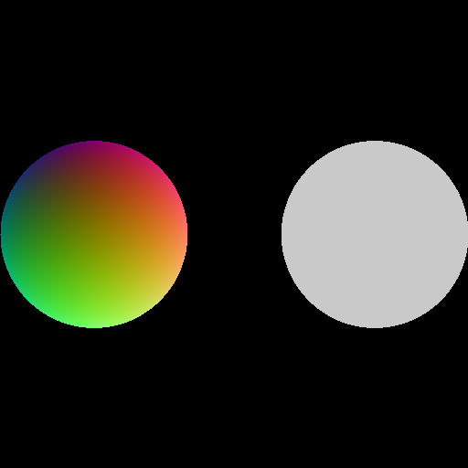

# [11_multi_custom_intersection](../tutorials/11_multi_custom_intersection)

<br />

<div align="center">
    
</div>

There is not much to say about this demo as custom intersection is already detailed in [this other demo](03_custom_intersection.md).

One difference compared to the previous demo is that we use 2 custom functions:


```cpp
  std::vector<hiprtFuncNameSet> funcNameSets( GeomTypesCount );
  funcNameSets[SphereTypeIndex].intersectFuncName = "intersectSphere";
  funcNameSets[CircleTypeIndex].intersectFuncName = "intersectCircle";
```
<br />

we use the same `intersectSphere` than in the previous demo, but we also introduce this new `intersectCircle` custom intersection:

```cpp
  // check if there is a hit before ray.maxT. if there is, set it to tOut. hiprt will overwrite ray.maxT after this function
  __device__ bool intersectCircle( const hiprtRay& ray, const void* data, void* payload, hiprtHit& hit )
  {
    const float4* o = reinterpret_cast<const float4*>( data );
    float2		  c = make_float2( o[hit.primID].x, o[hit.primID].y );
    const float	  r = o[hit.primID].w;

    c.x			 = c.x - ray.origin.x;
    c.y			 = c.y - ray.origin.y;
    float d		 = sqrtf( c.x * c.x + c.y * c.y );
    bool  hasHit = d < r;
    if ( !hasHit ) return false;

    hit.normal = normalize( make_float3( d, d, d ) );

    return true;
  }
```

<br />


Note that we now have 2 `geomType`:
```cpp
  constexpr uint32_t SphereTypeIndex = 0;
  constexpr uint32_t CircleTypeIndex = 1;
```

<br />

Another difference is that in this demo, we use a `hiprtScene`, so in the kernel, we have to use `hiprtSceneTraversalClosest` instead of `hiprtGeomCustomTraversalClosest`, as explained in the [demo introducing the hiprtScene](02_scene_intersection.md).

  
