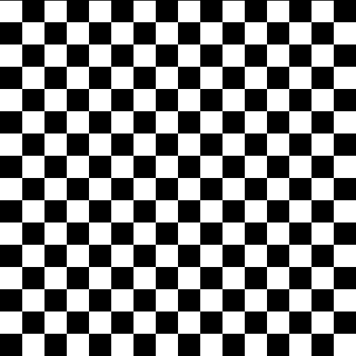

# HIPRT Tutorials

## List of tutorials

|   |   |  |
|---|---|--|
|[01_geom_intersection](./01_geom_intersection)   |   | Intersection using hiprtGeometry. |
|[02_scene_intersection](./02_scene_intersection)   |   | Intersection using hiprtScene. |
|[03_custom_intersection](./03_custom_intersection)   |   | Using a custom intersection function. |
|[04_shared_stack](./04_shared_stack)   |   | Using shared stack for traversal which is essential to get a good performance. | 
|[05_custom_bvh](./05_custom_bvh_import)   |   | Loading a BVH a user provides. |
|[06_ambient_occlusion](./06_ambient_occlusion)   |   | Ambient occlusion. |
|[07_motion_blur_srt](./07_motion_blur)   |   | Rendering objects under motion using SRT components. |
|[08_motion_blur_matrix](./08_motion_blur)   |   | Rendering objects under motion using Matrix. |
|[09_multi_custom_intersection](./09_multi_custom_intersection)   |   | Multiple primitives with custom intersection. |
|[10_cutout](./10_cutout)   |   | Alpha masking using the intersection filter. |
|[11_concurrent_scene_build](./11_concurrent_scene_build)   |   | Build geometries using multiple streams concurrently. |
