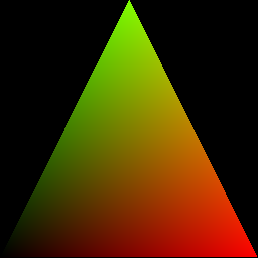
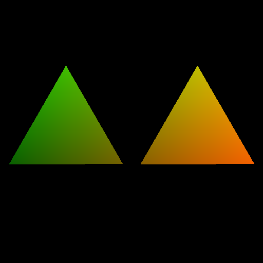
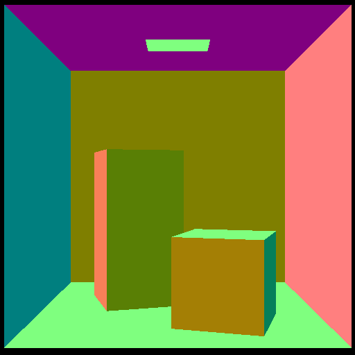
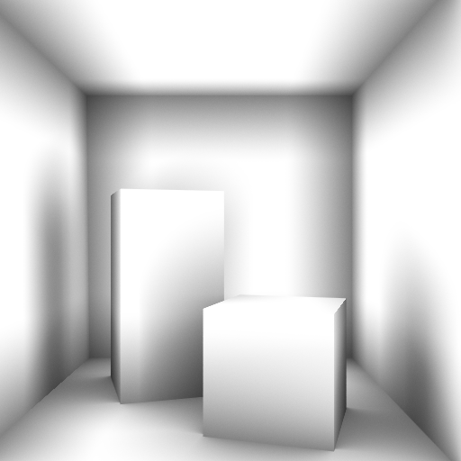

# HIPRT Tutorials

## List of tutorials

|   |   |  |
|---|---|--|
|[01_geom_intersection](./01_geom_intersection)   |   | Intersection using hiprtGeometry. |
|[02_scene_intersection](./02_scene_intersection)   |   | Intersection using hiprtScene. |
|[03_custom_intersection](./03_custom_intersection)   |   | Using custom intersection function. |
|[04_shared_stack](./04_shared_stack)   |   | Using shared stack for traversal which is essential to get a good performance. | 
|[05_custom_bvh](./05_custom_bvh_import)   |   | Loading a BVH a user provide. |
|[06_obj_AO](./06_obj_AO)   |   | Loading obj file and rendering AO. |
|[07_motion_blur](./07_motion_blur)   |   | Rendering objects under motion. |
