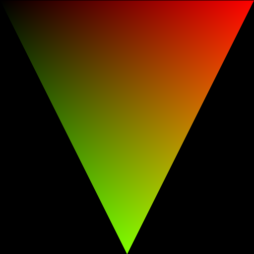
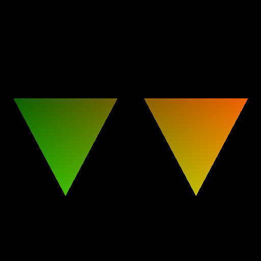

# HIPRT Tutorials

## List of tutorials

|   |   |  |
|---|---|--|
|[01_geom_intersection](./01_geom_intersection)   |   | Intersection using hiprtGeometry. |
|[02_scene_intersection](./02_scene_intersection)   |   | Intersection using hiprtScene. |
|[03_custom_intersection](./03_custom_intersection)   |   | Using a custom intersection function. |
|[04_global_stack](./04_global_stack)   |   | Global traversal stack for good performance. | 
|[05_dynamic_stack](./05_dynamic_stack)   |   | Dynamic traversal stack for balancing performance and memory requirements. | 
|[06_custom_bvh](./06_custom_bvh_import)   |   | Loading a BVH a user provides. |
|[07_ambient_occlusion](./07_ambient_occlusion)   |   | Ambient occlusion. |
|[08_motion_blur_srt](./08_motion_blur)   |   | Rendering objects under motion using SRT components. |
|[09_motion_blur_matrix](./09_motion_blur)   |   | Rendering objects under motion using Matrix. |
|[10_multi_custom_intersection](./10_multi_custom_intersection)   |   | Multiple primitives with custom intersection. |
|[11_cutout](./11_cutout)   |   | Alpha masking using the intersection filter. |
|[12_concurrent_scene_build](./12_concurrent_scene_build)   |   | Build geometries using multiple streams concurrently. |
|[13_batch_build](./13_batch_build)   |   | Build small geometries concurrently in a single batch. |
|[14_fluid_simulation](./14_fluid_simulation)   |   | A simple fluid simulation. |
