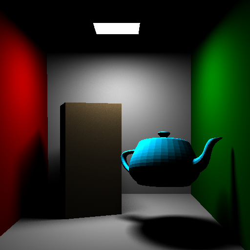
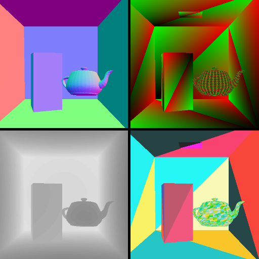

# HIPRT Tutorials

## List of tutorials

| Demo name  | Image  | Documentation | Description |
|---|:---:|:--:|--|
|[01_geom_intersection](./01_geom_intersection)   |   | [:page_facing_up:](../doc/01_geom_intersection.md) | Intersection using hiprtGeometry. |
|[02_scene_intersection](./02_scene_intersection)   |   | [:page_facing_up:](../doc/02_scene_intersection.md) | Intersection using hiprtScene. |
|[03_custom_intersection](./03_custom_intersection)   |   | [:page_facing_up:](../doc/03_custom_intersection.md) | Using a custom intersection function. |
|[04_compaction](./04_compaction)   |   | | Acceleration structure compaction. |
|[05_global_stack](./05_global_stack)   |   | | Global traversal stack for good performance. | 
|[06_dynamic_stack](./06_dynamic_stack)   |   | | Dynamic traversal stack for balancing performance and memory requirements. | 
|[07_custom_bvh](./07_custom_bvh_import)   |   | [:page_facing_up:](../doc/07_custom_bvh_import.md) | Loading a BVH a user provides. |
|[08_ambient_occlusion](./08_ambient_occlusion)   |   | [:page_facing_up:](../doc/08_ambient_occlusion.md) | Ambient occlusion. |
|[09_motion_blur_srt](./09_motion_blur)   |   | | Rendering objects under motion using SRT components. |
|[10_motion_blur_matrix](./10_motion_blur)   |   | | Rendering objects under motion using Matrix. |
|[11_multi_custom_intersection](./11_multi_custom_intersection)   |   | [:page_facing_up:](../doc/11_multi_custom_intersection.md) | Multiple primitives with custom intersection. |
|[12_cutout](./12_cutout)   |   | | Alpha masking using the intersection filter. |
|[13_concurrent_scene_build](./13_concurrent_scene_build)   |   | | Build geometries using multiple streams concurrently. |
|[14_batch_build](./14_batch_build)   |   | | Build small geometries concurrently in a single batch. |
|[15_multi_level_instancing](./15_multi_level_instancing)   |   | | Multi-level instancing. |
|[16_fluid_simulation](./16_fluid_simulation)   |   | | A simple fluid simulation. |
|[18_shadow_ray](./18_shadow_ray)   |   | [:page_facing_up:](../doc/18_shadow_ray.md) | Shows how to trace a shadow ray in an OBJ scene. |
|[19_primary_ray](./19_primary_ray)   |   | [:page_facing_up:](../doc/19_primary_ray.md) | Shows how to trace different types of primary rays in an OBJ scene. |
